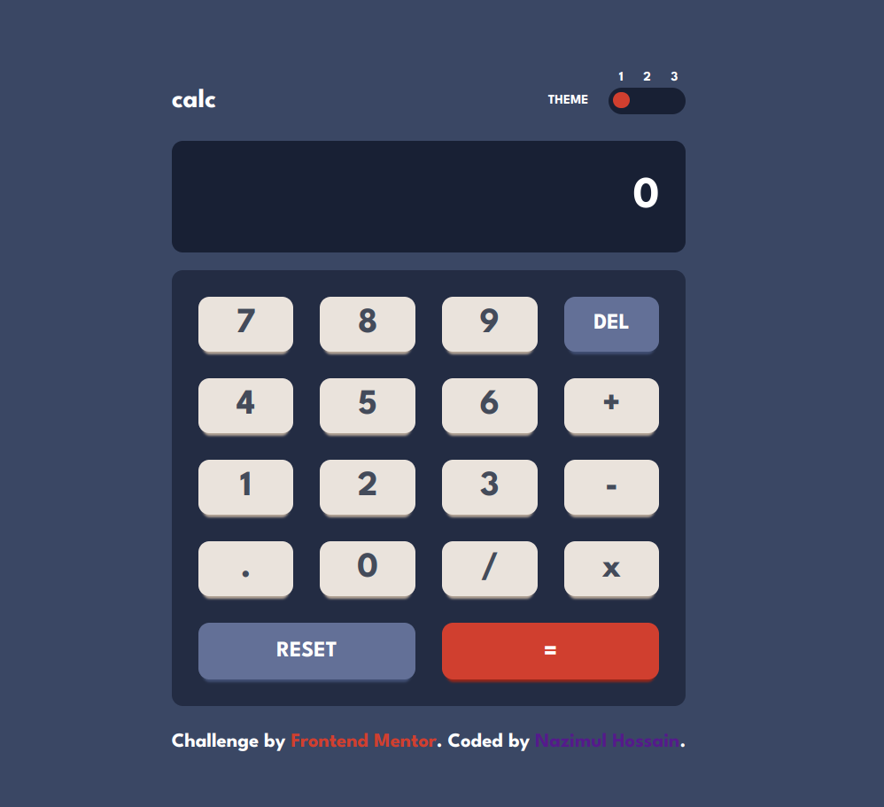
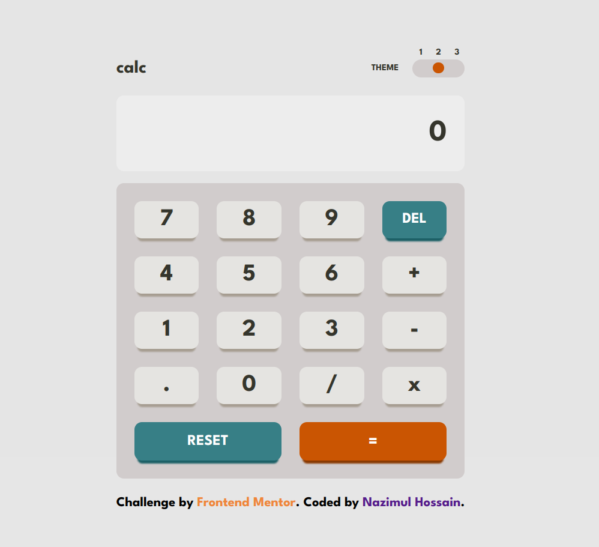
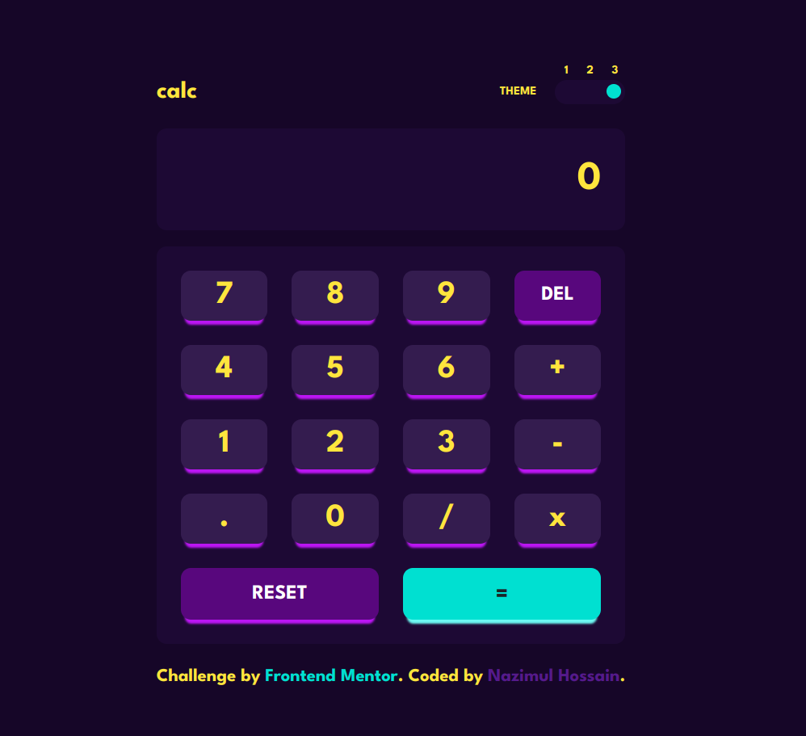

# Frontend Mentor - Calculator app solution

This is a solution to the [Calculator app challenge on Frontend Mentor](https://www.frontendmentor.io/challenges/calculator-app-9lteq5N29). Frontend Mentor challenges help you improve your coding skills by building realistic projects.

## Table of contents

- [Overview](#overview)
  - [The challenge](#the-challenge)
  - [Screenshot](#screenshot)
  - [Links](#links)
- [My process](#my-process)
  - [Built with](#built-with)
  - [What I learned](#what-i-learned)
  - [Continued development](#continued-development)
  - [Useful resources](#useful-resources)
- [Author](#author)

## Overview

### The challenge

Users should be able to:

- See the size of the elements adjust based on their device's screen size
- Perform mathmatical operations like addition, subtraction, multiplication, and division
- Adjust the color theme based on their preference
- **Bonus**: Have their initial theme preference checked using `prefers-color-scheme` and have any additional changes saved in the browser

### Screenshot


- Theme 1 :



- Theme 2 :



- Theme 3 :



### Links

- Solution URL: [https://github.com/nazimulhossain/react-calculator-app](https://github.com/nazimulhossain/react-calculator-app)
- Live Site URL: [Add live site URL here](https://your-live-site-url.com)

## My process

### Built with

- Semantic HTML5 markup
- CSS custom properties
- Flexbox
- CSS Grid
- [React](https://reactjs.org/) - JS library

### What I learned

How to use html input range slider and custom style using css.

To see how you can add code snippets, see below:

```html
<input type="range" min="1" max="3" value="1" />
```

```css
input[type='range'] {
  -webkit-appearance: none;
  appearance: none;
  background: transparent;
  width: 7rem;
}

input[type='range']::-webkit-slider-runnable-track {
  height: 2.4rem;
  background-color: var(--screen-background);
  border-radius: 1.5rem;
  padding-left: 0.4rem;
  padding-right: 0.4rem;
  cursor: pointer;
}

input[type='range']::-webkit-slider-thumb {
  -webkit-appearance: none;
  appearance: none;
  width: 1.5rem;
  height: 1.5rem;
  border-radius: 50%;
  background-color: var(--Red);
  margin-top: 0.4rem;
}

input[type='range']::-webkit-slider-thumb:hover {
  background-color: hsl(6, 71%, 66%);
}
```

## Author

- Frontend Mentor - [@nazimulhossain](https://www.frontendmentor.io/profile/nazimulhossain)
